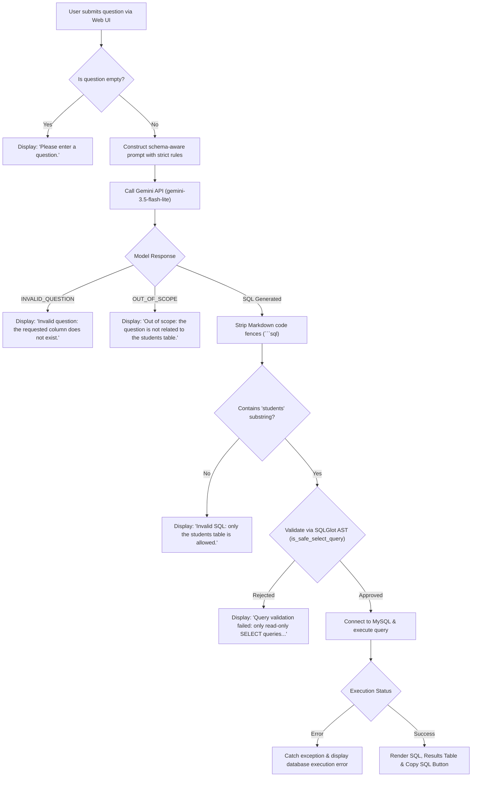

# Text-to-SQL: Natural Language to SQL Query Generator

A full-stack Python and Flask web application that converts plain-English questions into SQL queries using Google's Gemini API (`gemini-3.5-flash-lite`), validates generated queries using Abstract Syntax Tree (AST) analysis via **SQLGlot**, and executes safe read-only queries against a **MySQL** database with tabular results displayed in real time.

---

## Project Overview

Writing SQL queries can be challenging for non-technical users or domain experts who want quick answers from a database. This project bridges that gap by allowing users to enter natural-language questions (e.g., *"Show students whose marks are greater than 80"* or *"Count the number of students in Delhi"*).

The application processes the input through a multi-tier pipeline:
1. **Natural Language Processing**: Translates the question into SQL using Google Gemini API guided by schema-aware prompts and sentinel tokens.
2. **Defensive AST Validation**: Analyzes the generated query using `sqlglot` to verify that it is strictly a single, read-only `SELECT` statement targeting the authorized `students` table and permitted columns.
3. **Database Execution**: Connects to MySQL using `mysql-connector-python` to execute the validated query and fetch matching records.
4. **Interactive Web Interface**: Renders the generated SQL, error feedback, tabular database results, and a one-click clipboard copy utility.

---

## Workflow Architecture



---

## Key Features

- **Natural Language to SQL Generation**: Translates conversational questions into standard SQL queries using Google's `gemini-3.5-flash-lite` model via the `google-genai` SDK.
- **Schema-Aware Prompt Guardrails**: System instructions guide the LLM to restrict queries strictly to the defined schema and return special sentinel tokens (`INVALID_QUESTION`, `OUT_OF_SCOPE`) when appropriate.
- **AST-Based SQL Validation with SQLGlot**: Parses the generated SQL into an Abstract Syntax Tree using MySQL syntax rules to enforce strict security constraints before reaching the database.
- **Strict Query Sanitization**:
  - Rejects queries containing SQL comments (`--`, `/*`, `*/`, `#`).
  - Requires exactly one SQL statement (prevents stacked query injection).
  - Permits only `SELECT` operations.
  - Rejects `JOIN`, `UNION`, `INTERSECT`, `EXCEPT`, subqueries, and CTEs (`WITH`).
  - Restricts execution exclusively to the `students` table.
  - Enforces a column whitelist (`id`, `name`, `age`, `marks`, `city`, and `*`).
  - Restricts functions to safe mathematical/aggregate functions (`COUNT`, `AVG`, `SUM`, `MIN`, `MAX`, `ROUND`).
- **MySQL Database Integration**: Connects dynamically to a MySQL database using `mysql-connector-python` to execute validated queries.
- **Tabular Result Rendering**: Dynamically extracts column headers from `cursor.description` and renders query rows in a clean HTML table. Displays *"No records found."* if the query returns an empty result set.
- **One-Click Clipboard Copy**: Built-in vanilla JavaScript button allowing users to copy the generated SQL query with one click.
- **State Preservation**: Retains the user's input question in the form textarea across submissions for rapid refinement.
- **Comprehensive Error Handling**: Gracefully catches empty inputs, Gemini API failures, AST validation rejections, and MySQL database runtime errors without crashing the server.

---

## Tech Stack

| Component | Technology | Description |
| :--- | :--- | :--- |
| **Backend Framework** | Flask 3 | Lightweight WSGI web application framework handling routes and templating |
| **Language** | Python 3 | Core application language |
| **AI / LLM** | Google Gemini API (`gemini-3.5-flash-lite`) | Natural language understanding and SQL translation |
| **GenAI SDK** | `google-genai` | Official Google GenAI Python SDK |
| **SQL Parser & AST** | SQLGlot (`sqlglot`) | Dialect-aware SQL parser used for AST validation |
| **Database** | MySQL Server | Relational database hosting the target dataset |
| **Database Driver** | `mysql-connector-python` | Official MySQL database driver for Python |
| **Environment Config** | `python-dotenv` | Loads environment variables securely from `.env` |
| **Frontend** | HTML5, CSS, Vanilla JavaScript | Web interface with responsive forms, tabular display, and clipboard API |
| **Version Control** | Git & GitHub | Source code management |

---

## Database Schema

The application operates against a single table representing student information:

### Table: `students`

| Column | Data Type | Constraints | Description |
| :--- | :--- | :--- | :--- |
| `id` | `INT` | `AUTO_INCREMENT`, `PRIMARY KEY` | Unique identifier for each student |
| `name` | `VARCHAR(100)` | `NOT NULL` | Student's full name |
| `age` | `INT` | Nullable | Student's age |
| `marks` | `INT` | Nullable | Academic marks/score |
| `city` | `VARCHAR(100)` | Nullable | City of residence |

---

## Project Structure

```text
Text-to-SQL-Project/
├── templates/
│   └── index.html          # Web frontend template (form, SQL display, results table)
├── .env                    # Local environment variables (DB credentials, API key - gitignored)
├── .gitignore              # Ignores virtual environments (.venv), .env, and Python cache files
├── app.py                  # Main Flask application, Gemini integration, SQLGlot validator, DB execution
├── geminiapitest.py        # Standalone verification script for Gemini API connectivity
├── test_validator.py       # Automated test suite for SQLGlot query validation rules
└── README.md               # Project documentation
```

---

## Prerequisites

Before running the project, ensure you have the following installed:

1. **Python 3.10 or higher** (Python 3.12 recommended)
2. **MySQL Server 8.0 or higher** (running locally or accessible via network)
3. **Google Gemini API Key**: Obtainable from [Google AI Studio](https://aistudio.google.com/)
4. **Git** for repository cloning

---

## Installation and Setup

### 1. Clone the repository

```powershell
git clone https://github.com/om-saxena34/Text-to-SQL-Project.git
cd Text-to-SQL-Project
```

### 2. Create and activate a Python virtual environment

- **On Windows (PowerShell):**
  ```powershell
  python -m venv .venv
  .\.venv\Scripts\Activate.ps1
  ```

- **On Windows (Command Prompt):**
  ```cmd
  python -m venv .venv
  .venv\Scripts\activate.bat
  ```

- **On macOS / Linux:**
  ```bash
  python3 -m venv .venv
  source .venv/bin/activate
  ```

### 3. Install required dependencies

Install all required packages into your active virtual environment:

```powershell
pip install flask google-genai mysql-connector-python python-dotenv sqlglot
```

### 4. Configure environment variables

Create a `.env` file in the root project directory:

```env
GEMINI_API_KEY=your_gemini_api_key_here
DB_HOST=localhost
DB_NAME=texttosql
DB_USER=textsql_reader
DB_PASSWORD=your_mysql_password_here
```

> [!IMPORTANT]
> Never commit your `.env` file to version control. The repository's `.gitignore` file is already configured to exclude `.env`.

### 5. Set up the MySQL Database and Sample Table

Log in to your MySQL server (via MySQL Command Line Client, MySQL Workbench, or your terminal):

```sql
-- 1. Create the database
CREATE DATABASE IF NOT EXISTS texttosql;
USE texttosql;

-- 2. Create the students table
CREATE TABLE IF NOT EXISTS students (
    id INT AUTO_INCREMENT PRIMARY KEY,
    name VARCHAR(100) NOT NULL,
    age INT,
    marks INT,
    city VARCHAR(100)
);

-- 3. Insert sample data
INSERT INTO students (name, age, marks, city) VALUES
('Aarav Sharma', 20, 85, 'Delhi'),
('Diya Patel', 21, 92, 'Mumbai'),
('Rohan Gupta', 19, 78, 'Delhi'),
('Ananya Iyer', 22, 88, 'Bengaluru'),
('Kabir Singh', 20, 65, 'Pune'),
('Ishita Verma', 21, 95, 'Delhi'),
('Arjun Mehta', 23, 72, 'Mumbai');

-- 4. Create a restricted, read-only MySQL user (Defense-in-Depth)
CREATE USER IF NOT EXISTS 'textsql_reader'@'localhost' IDENTIFIED BY 'your_mysql_password_here';
GRANT SELECT ON texttosql.students TO 'textsql_reader'@'localhost';
FLUSH PRIVILEGES;
```

---

## Environment Variables

| Variable Name | Required | Default / Example | Purpose |
| :--- | :--- | :--- | :--- |
| `GEMINI_API_KEY` | Yes | `AIzaSy...` | API key used by `google-genai` to access Gemini models |
| `DB_HOST` | Yes | `localhost` | Hostname or IP address of the MySQL server |
| `DB_NAME` | Yes | `texttosql` | Name of the database containing the `students` table |
| `DB_USER` | Yes | `textsql_reader` | MySQL username (recommended: restricted read-only user) |
| `DB_PASSWORD` | Yes | `your_password` | Password for the MySQL user account |

---

## Usage

### 1. (Optional) Verify Gemini API Connectivity

Run the standalone verification script to test your Gemini API key and prompt response:

```powershell
python geminiapitest.py
```

### 2. Start the Flask Application

Run the application with:

```powershell
python app.py
```

The Flask development server starts locally:
```text
 * Serving Flask app 'app'
 * Debug mode: on
 * Running on http://127.0.0.1:5000
```

### 3. Open in Browser and Execute Queries

1. Open `http://127.0.0.1:5000` in your web browser.
2. Enter a natural language question in the textarea.
3. Click **Convert to SQL**.
4. View the generated SQL statement, use **Copy SQL** to copy it to your clipboard, and inspect the retrieved records in the query results table.

### Example Questions & Expected Outputs

| Natural Language Question | Generated SQL Query | Query Status / Execution Result |
| :--- | :--- | :--- |
| *"Show all students whose marks are greater than 80"* | `SELECT * FROM students WHERE marks > 80;` | Approved & Executed (returns matching rows) |
| *"Find students who live in Delhi"* | `SELECT * FROM students WHERE city = 'Delhi';` | Approved & Executed (returns Delhi records) |
| *"Count the total number of students"* | `SELECT COUNT(*) FROM students;` | Approved & Executed (returns count) |
| *"Show the average marks of students"* | `SELECT AVG(marks) FROM students;` | Approved & Executed (returns average) |
| *"Show students sorted by marks descending"* | `SELECT * FROM students ORDER BY marks DESC;` | Approved & Executed (returns sorted rows) |
| *"Show students with their phone numbers"* | `INVALID_QUESTION` | Rejected at LLM stage (column does not exist) |
| *"What is the weather in Delhi?"* | `OUT_OF_SCOPE` | Rejected at LLM stage (unrelated to students table) |

---

## SQL Safety and Validation

Allowing an AI model to generate SQL that executes against a live database presents significant security considerations, including SQL injection, cross-table data exfiltration, and resource exhaustion.

To mitigate these risks, this project implements a **multi-layered validation architecture**:

### 1. Pre-Execution AST Parsing (`sqlglot`)
The `is_safe_select_query(query)` function in `app.py` enforces the following deterministic rules using `sqlglot`:

1. **Comment Rejection**: Rejects any query containing `--`, `/*`, `*/`, or `#`.
2. **Single-Statement Rule**: Parses the query via `sqlglot.parse(cleaned, read="mysql")` and requires exactly one statement (`len(statements) == 1`). Multi-statement query chaining is blocked.
3. **Select-Only Root**: Verifies that the root AST node is strictly `sqlglot.expressions.Select`. Data modification (`INSERT`, `UPDATE`, `DELETE`) and schema manipulation (`DROP`, `ALTER`, `TRUNCATE`) are blocked.
4. **No Joins or Set Operations**: Checks `tree.find(exp.Join)` and `tree.find(exp.Union)`. Cross-table joins and UNION-based data extraction are strictly rejected.
5. **No Subqueries or CTEs**: Checks `tree.find(exp.Subquery)` and `tree.find(exp.CTE)`. Nested queries and common table expressions are rejected.
6. **Table Whitelist**: Inspects all `exp.Table` nodes. Rejects any query referencing a table other than `students`.
7. **Column Whitelist**: Inspects all `exp.Column` nodes. Only `id`, `name`, `age`, `marks`, `city`, and wildcard `*` are allowed. Qualified columns referencing unexpected table aliases are blocked.
8. **Function Whitelist**: Inspects all `exp.Func` nodes. Only whitelisted aggregate/scalar functions (`COUNT`, `AVG`, `SUM`, `MIN`, `MAX`, `ROUND`) are permitted. Destructive or dangerous functions (such as `SLEEP()`, `BENCHMARK()`, `LOAD_FILE()`, `USER()`) are blocked.

### 2. Database Least-Privilege Account (Defense-in-Depth)
Application-layer validation is complemented by database-level access controls:
- The application connects using a dedicated user (`textsql_reader`) granted **only** `SELECT` privileges on `texttosql.students`.
- Even if an unvalidated query were somehow processed by the application layer, the database engine enforces read-only access and denies any modification, deletion, or access to other tables and databases.

> [!WARNING]
> While these validation checks significantly restrict the attack surface, no dynamic SQL execution system should be considered 100% immune to vulnerabilities. The protections implemented here are scoped specifically for a single-table educational prototype.

---

## Testing

The project includes an automated validation test script, `test_validator.py`, to verify that `is_safe_select_query()` correctly permits legitimate queries and rejects unsafe or out-of-scope queries without requiring database connectivity.

### Running the Validation Tests

Activate your virtual environment and run:

```powershell
python test_validator.py
```

### Verified Test Cases

The test suite in `test_validator.py` evaluates the following 13 specific cases:

| Query | Expected Result | Actual Result | Rule Enforced |
| :--- | :---: | :---: | :--- |
| `SELECT * FROM students` | `True` | `True` | Allowed: Wildcard selection on authorized table |
| `SELECT name FROM students WHERE marks > 80` | `True` | `True` | Allowed: Permitted column with numeric filter |
| `SELECT COUNT(*) FROM students` | `True` | `True` | Allowed: Whitelisted aggregate function and wildcard |
| `SELECT name FROM students JOIN users ON 1=1` | `False` | `False` | Blocked: `JOIN` expressions are forbidden |
| `SELECT name FROM students UNION SELECT name FROM users` | `False` | `False` | Blocked: `UNION` operations are forbidden |
| `SELECT salary FROM students` | `False` | `False` | Blocked: `salary` is not in the column whitelist |
| `DELETE FROM students` | `False` | `False` | Blocked: Non-SELECT statements are forbidden |
| `SELECT name FROM students; SELECT name FROM users` | `False` | `False` | Blocked: Stacked statements are forbidden |
| `SELECT name FROM students WHERE city = 'Delhi'` | `True` | `True` | Allowed: Permitted column with string filter |
| `SELECT SLEEP(5) FROM students` | `False` | `False` | Blocked: `SLEEP` is not an approved function |
| `SELECT name FROM users` | `False` | `False` | Blocked: Query targets an unauthorized table (`users`) |
| `SELECT name FROM students WHERE id = 1 -- comment` | `False` | `False` | Blocked: SQL comments are forbidden |
| `SELECT s.name FROM students s` | `False` | `False` | Blocked: Table alias `s` does not match table whitelist rule |

---

## Limitations and Future Improvements

### Current Limitations
- **Single-Table Scope**: The application only supports the `students` table. Multi-table schemas and relational queries are not supported.
- **Table Aliases Not Permitted**: Queries using table aliases (e.g., `SELECT s.name FROM students s`) are currently blocked because column validation requires the qualifier to match `"students"` directly.
- **Subqueries Disabled**: Even legitimate subqueries (such as *"Show students with marks above the average"* &rarr; `WHERE marks > (SELECT AVG(marks) FROM students)`) are rejected by the strict no-subquery security rule.
- **Unbounded Result Sets**: The application does not automatically append or enforce a `LIMIT` clause, meaning large queries could return substantial datasets into memory.
- **Development Server**: The application runs via Flask's built-in development server and is not configured for production WSGI servers (e.g., Gunicorn or Waitress).
- **No User Management**: Does not include user authentication, session handling, or query history persistence.

### Future Improvements
- [ ] **Safe Subquery Evaluation**: Support single-table subqueries on `students` while maintaining strict isolation from external tables.
- [ ] **Alias Resolution**: Enhance the AST validator to resolve table aliases (e.g., `students s`) so standard aliased queries are recognized safely.
- [ ] **Pagination and Result Limits**: Enforce default pagination (e.g., `LIMIT 50`) to optimize query performance and prevent memory exhaustion.
- [ ] **Multi-Table Relational Support**: Extend the schema and validator to support defined foreign key relationships and explicitly approved `INNER JOIN` operations.
- [ ] **Production Deployment**: Configure a production WSGI server (e.g., Gunicorn or Waitress) and containerize the application using Docker.

---

## Author

**Om Saxena**
- GitHub: [@om-saxena34](https://github.com/om-saxena34)
- Repository: [om-saxena34/Text-to-SQL-Project](https://github.com/om-saxena34/Text-to-SQL-Project)